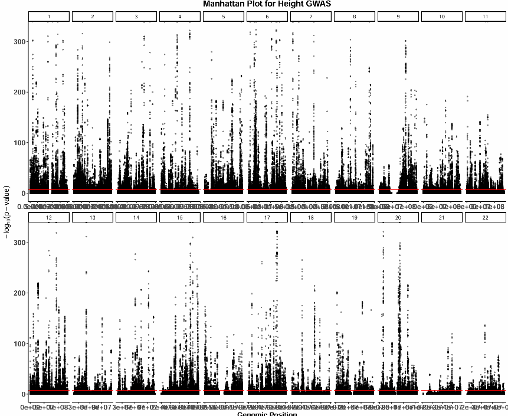
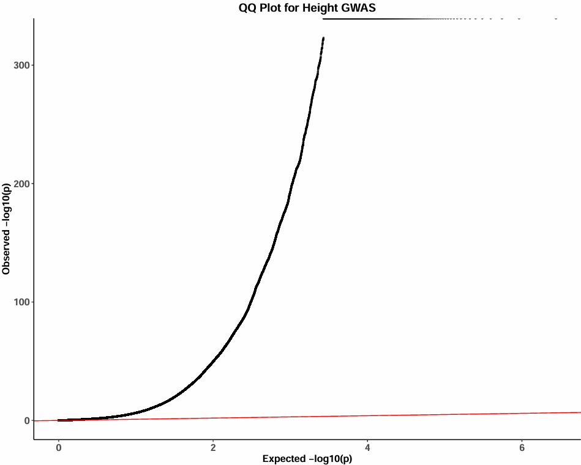

# Polygenic-Risk-Score-Analysis-and-Fine-mapping  
# Polygenic Risk Score Analysis and Fine-Mapping of Height-associated Variants Across European and African Populations  

## 📘 Project Overview  
Polygenic risk scores are increasingly used in clinical research and population health studies; however, their predictive performance varies across ancestral groups. PRS performance often decreases when applied across ancestries due to differences in genetic architecture, allele frequencies, and linkage disequilibrium patterns This project demonstrates a reproducible workflow for integrating GWAS summary statistics with population genotype data to evaluate polygenic risk score transferability and perform locus-level fine mapping across diverse ancestral populations to imporve the robustness and interpretability. 
The key analysis of this project include:
- Genome-wide visualization of height associated GWAS signals (Manhattan and QQ plots)
- Comparison of height-related effect sizes across ancestries
- Construction and analysis of polygenic risk scores (PRS) across population of different ancestry
- Evaluation of PRS transferability across ancestries
- Fine-mapping of top loci to detect credible causal variants
## Background  
Human height is a complex polygenic trait shaped by numerous genetic variants with small effects. Leveraging the GIANT consortium summary statistics (Yengo et al., 2022) and 1000 Genomes genotypes, this study investigates the genetic architecture of height between European (EUR) and African (AFR) ancestry populations. Publicly available GWAS summary statistics for height from the Yengo 2022 (GIANT consortium) and Genotype data from 1000 Genomes Project Phase 3 were used for this study. Here, height is used for demonstration, the pipeline can be adapted to any trait with available GWAS summary statistics: Type 2 Diabetes, cancers, coronary artery disease. To do so:  
1. Replace `height_sumstats.txt.gz` with your summary statistics
2. Ensure the same column formatting (CHR, BP, SNP, A1, A2, BETA/OR, SE, P)
3. Run scripts in the order shown under `scripts/`
4. Evaluate PRS performance in your validation cohorts.
All analyses, visualizations, and interpretations are original work by Rachana Pandey.

 ## Methods  
 **1. GWAS Visualization**  
 - To visualize genome-wide association signals and assess potential $p$-value inflation, Manhattan and Q-Q plots were generated using the **ggplot2** framework. 
 - These visualizations utilize summary statistics from the GIANT Consortium height GWAS to evaluate the distribution of association signals and identify significant deviations from the null distribution across the genome.
<p align="center">
  
</p>
<p align="center">
  
</p>


 **2.Effect Size Comparison Across Populations**  
 - Effect sizes from the European and African GWAS datasets were compared to evaluate ancestry-specific genetic differences.
 - SNP effect size differences for were calculated as: beta_difference = beta_EUR − beta_AFR.
 - The distribution of these differences was visualized to assess the magnitude of population-specific variation.
 - The top SNPs with the largest effect size differences were identified and visualized.

**3.Polygenic Risk Score Construction** 
- Polygenic risk scores were constructed via the clumping and thresholding (C+T) approach using PLINK2.1.
- Independent SNPs were selected using linkage disequilibrium (LD)-based clumping with the following parameters:
  **P-value threshold:** $P < 5 \times 10^{-8}$
  **LD threshold:** $r^2 < 0.1$
  **Clumping window:** $250$ kb
- European GWAS effect sizes from the GIANT consortium were used as weights to calculate PRS for individuals in the 1000 Genomes Project dataset.

**4. PRS Transferability Analysis**  
- PRS distributions between European (EUR) and African (AFR) populations were compared using density plots generated with ggplot2.

**5. Fine Mapping of Candidate Loci**  
- Fine mapping was performed for the SNP with the largest effect size difference between populations (rs11645785).
- A genomic region spanning ±500 kb around the SNP was extracted.
- Linkage disequilibrium matrices were computed using genotype data from European individuals in the 1000 Genomes dataset.
- Statistical fine mapping was performed using the **SuSiE** (Sum of Single Effects) model implemented in the **susieR** R package.
- This approach identifies credible sets of candidate causal variants within the locus.

## 🧪 Major Findings

- **GWAS Visualization:** Manhattan and QQ plots revealed multiple strong polygenic signals for height, with significant inflation at the tail end of p-values.
- **Effect Size Differences:** Most SNPs showed similar effect sizes across populations, but a subset(10 SNPs) exhibited substantial differences between European and African populations.
- **PRS Distributions and Transferability:** PRS distributions differed between populations. PRS scores were significantly higher in EUR compared to AFR populations when using EUR-derived summary stats—highlighting the challenge of cross-ancestry PRS transferability.
- **Fine-Mapping:** Fine-mapping around the SNP rs11645785 (which had the largest effect size difference) identified a credible set of causal variants. Because variants within the region are in strong linkage disequilibrium, statistical fine-mapping cannot isolate a single causal variant and instead identifies a credible set of candidates.

## 🧰 Tools and Data

- **Summary Stats:** GIANT Consortium (Yengo 2022)
- **Genotypes:** 1000 Genomes Phase 3
- **Software:** `plink2.1`, `susieR`, R packages including `ggplot2`, `data.table`

## 📁 Repository Structure  
```
├── report/
│ ├── Analysis-Report.pdf # Final report
│ └── Analysis.Rmd # Annotated R Markdown file with full analysis pipeline
│
├── results/
│ ├── manhattan_plot.png # manhattan plot for height GWAS across all population in giant consortium
│ ├── qq_plot.png # QQ plot for for height GWAS and p-value inflation across all population in giant consortium
│ ├── effect_size_diff.png # distribution of effect size difernce between european and african in giant consortium
│ ├── PRS_distribution.png # PRS density distribution across EUR and AFR
│ ├── Top_10_SNPs #top 10 SNps with largest effect size difference in european and african in giant 2022
│ ├──  PRS_distribution #PRS distribution across 1k genome european and african population
│ └── fine_mapping_rs11645785.png # Regional finemapping of top SNP rs11645785 in giant consortium
│
├── scripts/
│ ├── data_download.sh
│ ├── GWAS_visualization.R
│ ├── EUR_AFR_effect_size_diff.R
│ ├── Plink_clumping.sh
│ ├── PRS_pipeline.R
│ ├── Fine_mapping.R

```
## Run the scripts in given order  
1. data_download.sh
2. GWAS_visualization.R
3. EUR_AFR_effect_size_diff.R
4. Plink_clumping.sh
5. PRS_pipeline.R
6. Fine_mapping.R

## References  
1. Yengo, L., Vedantam, S., Marouli, E., Sidorenko, J., Bartell, E., Sakaue, S., ... & Lee, J. Y. (2022). A saturated map of common genetic variants associated with human height. Nature, 610(7933), 704-712.
2. Wang, G., Sarkar, A., Carbonetto, P., & Stephens, M. (2020). A simple new approach to variable selection in regression, with application to genetic fine mapping. Journal of the Royal Statistical Society Series B: Statistical Methodology, 82(5), 1273-1300.
3. Chang, C. C., Chow, C. C., Tellier, L. C., Vattikuti, S., Purcell, S. M., & Lee, J. J. (2015). Second-generation PLINK: rising to the challenge of larger and richer datasets. Gigascience, 4(1), s13742-015.


## 🙋‍♀️ Author
**Rachana Pandey**  
PhD Student, Translational Bioinformatics  
University of Minnesota Twin Cities
